# Machine Learning Engineer Nanodegree
## Capstone Project Report
Ming Zhong
July 23rd, 2019

-------
### Background and Introduction

In traditional markets, customer clustering / segmentation is one of the most significant methods
used in studies of marketing. This study classifies existing customer cluster/segmentation
methods into methodology-oriented and application-oriented approaches. Most methodology driven studies used mathematical methodologies; e.g statistics, neural net, generic algorithm (GA)
and Fuzzy set to identify the optimized segmented homogenous group.

In recent years, it has been recognized that the partitioned clustering technique is Ill suited for
clustering a large dataset due to their relatively low computational requirements. Behavioral
clustering and segmentation help derive strategic marketing initiatives by using the variables that
determine customer shareholder value. By conducting demographic clustering and segmentation
within the behavioral segments, I can define tactical marketing campaigns and select the
appropriate marketing channel and advertising for the tactical campaign. It is then possible to
target those customers most likely to exhibit the desired behavior by creating predictive models.

A general literature review can be found in the paper [*CUSTOMER DATA CLUSTERING USING DATA
MINING TECHNIQUE*](https://arxiv.org/pdf/1112.2663.pdf) by Dr. Sankar Rajagopal from Tata Consultancy Services.

My main motivation to work on this project is to explore the possibility in applying ML in marketing areas. Besides, I have two internship experience in E-commerce companies, that make me wonder how to combine ML and business together and create true value instead of doing simple class projects.

---------------
## Problem Statement

This competition is connected to one of Udacity's capstone project options for the Data Science Nanodegree program, in connection with Arvato Financial Solutions, a Bertelsmann subsidiary.

In the project, a mail-order sales company in Germany is interested in identifying segments of the general population to target with their marketing in order to grow. Demographics information has been provided for both the general population at large as Ill as for prior customers of the mail-order company in order to build a model of the customer base of the company. The target dataset contains demographics information for targets of a mailout marketing campaign. The objective is to identify which individuals are most likely to respond to the campaign and become customers of the mail-order company.

As part of the project, half of the mailout data has been provided with included response column. For the competition, the remaining half of the mailout data has had its response column withheld; the competition will be scored based on the predictions on that half of the data.

----------------
## Datasets and Inputs

The data for this project is provided by Udacity partners at Bertelsmann Arvato Analytics, and represents a real-life data science task. It includes general population dataset, customer segment data set, dataset of mail-out campaign with response and test dataset that needs to make predictions.

There are four datasets, all of which have identical demographics features (only part of them are different)

Two dataset for customer segmentation analysis:
* *Udacity_AZDIAS_052018.csv*: Demographics data for the general population of Germany; 891,211 persons (rows) x 366 features (columns)

* *Udacity_CUSTOMERS_052018.csv*: Demographics data for customers of a mail-order company; 191,652 persons (rows) x 369 features (columns)

Because these two datasets are the demographics characteristics of general population and company's customers. It is worthy to explore and compare the clustering analysis betIen these two groups. And match the general population with our customers. Then, I are able to find out the targeted population that share similar behaviors as our current customers. After cleaning these two datasets in similar fashion, I would like to perform clustering analysis on both datasets with same number of clusters. And then these two cluster distributions Ire then compared to see where the strongest customer base for the company is.

Two dataset for customer conversion prediction:
* *Udacity_MAILOUT_052018_TRAIN.csv*: Demographics data for individuals who Ire targets of a marketing campaign; 42,982 persons (rows) x 367 (columns).

* *Udacity_MAILOUT_052018_TEST.csv*: Demographics data for individuals who Ire targets of a marketing campaign; 42,833 persons (rows) x 366 (columns).
In addition to the above data, there are two additional meta-data:

* *DIAS Information Levels — Attributes 2017.xlsx*: a top-level list of attributes and descriptions, organized by informational category

* *DIAS Attributes — Values 2017.xlsx*: a detailed mapping of data values for each feature in alphabetical order

After customers segmentation, I also want to build a model that can predict whether a potential customer will convert or not in our mail-out list. HoIver, only train set is retained. The test set is withheld for the purpose of Kaggle competition. In order to train and validate our classifier, I need to split the training set into training subset and validation subset. And because of the highly imbalanced nature of our dataset, I need to apply cross-validation(probably with 10 subsets) to train and validate our model.

After training and picking out the best kind of model, I may want to use the same train set to do parameters tuning to further improve our model performance. In the meantime, some classifying method may output the feature importance data that can allow us to communicate our result in business language easily.

In the last step, I prefer to use decision tree to repeat the process again for the sake of better understand and visualize classification results.

----------------
## Solution Statement

There are 4 steps to finish the project:
* Data pre-processing: clean and re-encode data.

  Missing values by columns and rows will be analyzed, data will be divided by types folloId by subsequent transformations.

* Segmentation:create clusterings of customer and general population, and then identify the difference.

 Use principal component analysis (PCA) technique for dimensionality reduction. Then, elbow and other methods will be used to identify the best number of clusters for clustering algorithm. Finally, apply clustering to make segmentation of population and customers and determine description of target cluster for the company.

* Prediction: use the demographic features to predict whether or not a person became a customer after a mail-out campaign.

 Build machine learning model using response of marketing campaign and use model to predict which individuals are most likely to convert into becoming customers for the company.

 I will use several machine learning classifiers and choose the best using analysis of learning curve(ROC-AUC). Then, I will parametrize the model and make predictions.

* Kaggle competition: The results of this part need to be submitted for Kaggle competition.

------------------
## Evaluation Metrics

Because of the data imbalance, I cannot only use recall and accuracy as metrics to measure the model performance. I should consider TP and FP at the same time. Therefore, using ROC-AUC is much more suitable.

-----------------
# Results and Discussion

## Customer Segmentation
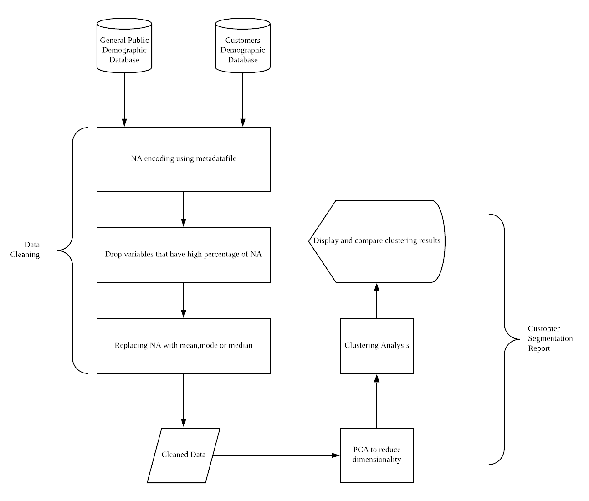
--------------
### Data Preprocessing

#### Missing Value Dictionary
After long hours of manual work, I general a csv file documented the missing value of every attributes mentions inside the meta-data file.

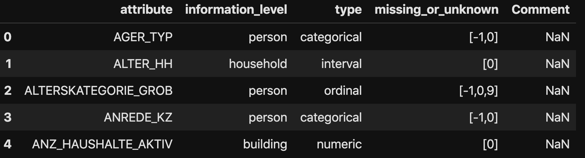

* Delete the variables found in the meta-data file but not found in the general population.

* For those variables that are found in the general population but missing in features I would like to take a closer look and try to maintain the information as much as possible.

First I append these variables inside the missing value manual file to enlarge our missing value documentation for further NA analysis. Then I replace those missing_or_unknown inside the dataset with NaN.

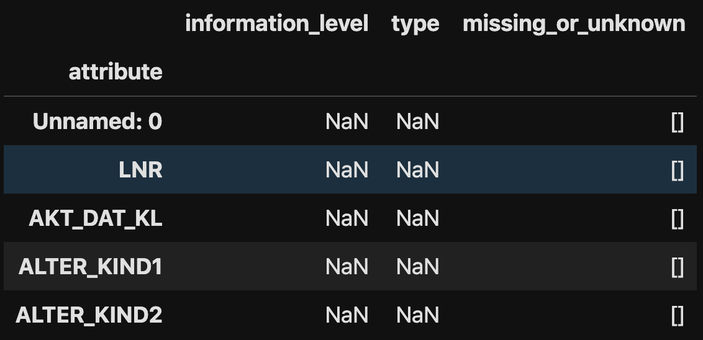

#### Assess Missing Data

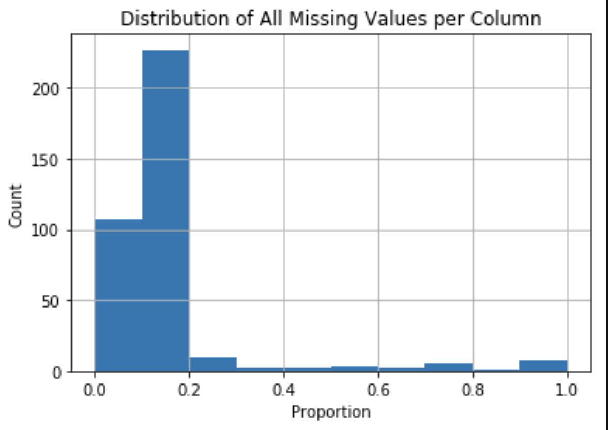

By plotting the percentage of missing value in each variables, I am able to tell that most of the variables are missing less than 30% of data.

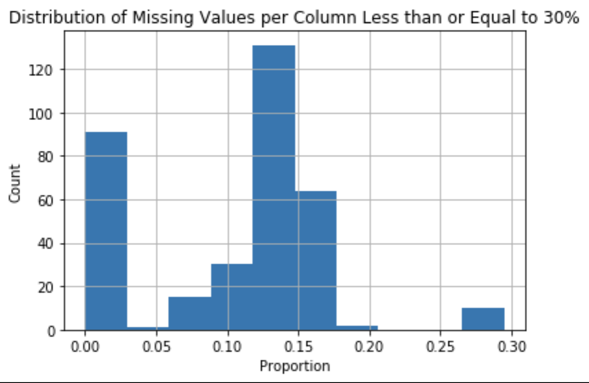

Therefore, it is reasonable to set 30% as a cutoff value to clean our data. I drop the variables that have over 30% missing values.

### Re-encode features

#### Variables Type Identification

Inside the *new_feature.csv*, I already identified most of the data variable types. However, after including some new variables from the general population dataset, I need to further investigate the data distribution of these new variables and try to identify their data types.

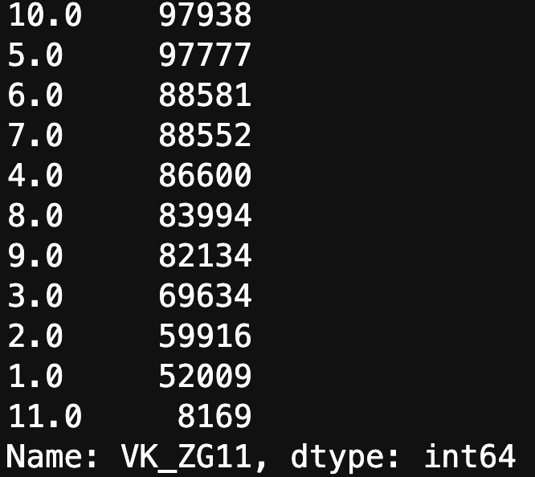

For example, the variable VK_ZG11 has 10 types of output, which means it could possibly be a categorical or ordinal variable. Combining with the data name and compared it with the existing variable names in our meta-data files, I can assume that this is an ordinal variable.

After tedious manual work, I can roughly classify our new variables into numerical, ordinal, categorical and mixed data types.

##### Categorical variables

For the categorical variable, I can go further and identify that whether they are binary or multilevel variables for the purpose of one-hot encoding.

##### Mixed-Type variables

After taking a look at several project reports online, I realize that this Mixed-Type variables engineering is the key point to boost your prediction result in Kaggle competition. There are totally 6 variables that are mixed types.

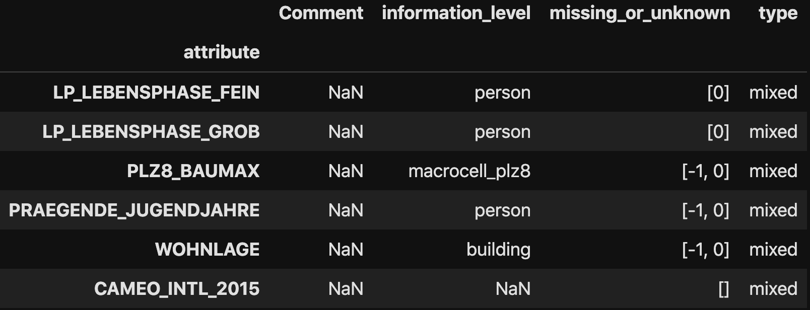

By digging into the definition of every variables via meta-data files, I choose to reengineer the 'PRAEGENDE_JUGENDJAHRE' and 'CAMEO_INTL_2015'.

* *PRAEGENDE_JUGENDJAHRE* - combines information on three dimensions: generation by decade, movement (mainstream vs. avantgarde), and nation (east vs. west). Three new variables will be created to capture the other two dimensions: an interval-type variable for decade, and two binary variables for movement and nation.

* *CAMEO_INTL_2015* - combines information on two axes: wealth and life stage. The two-digit codes will be broken by their 'tens'-place and 'ones'-place digits into two new ordinal variables (which, for the purposes of this project, is equivalent to just treating them as their raw numeric values).

And for simplicity, I just drop the variable 'LP_LEBENSPHASE_FEIN' because it contains so many levels and not easy to further reengineer.

Other mixed types variables we be converted using one-hot encoding into several dummy variables.

### Cleaning Pipeline

After formatting the strategy in cleaning data, I build a clean_data function in order to process the incoming new dataset in the same way.

### Feature transformations
After replacing missing value with column' mean and scale our data, it is natural to perform dimension reduction for computational simplicity.

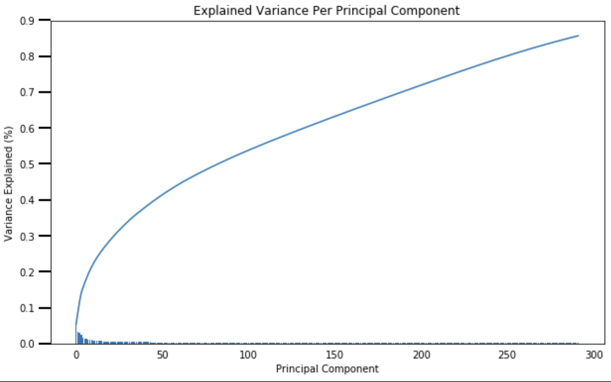

By reducing the dimensions to 300, the first 300 components can still explain 86% of our data.

### Component analysis
For each principal component or dimension, the top 3 and bottom 3 weights with their corresponding feature names will be investigated for any associations.

#### Dimension 1:
* MOBI_REGIO-moving patterns
* PLZ8_ANTG1-number of 1-2 family houses in the PLZ8
* KBA13_ANTG1-unknown
* KBA13_ANTG4-unknown
* KBA13_ANTG3-unknown
* PLZ8_ANTG3-number of 6-10 family houses in the PLZ8
#### Interpretation:
The first principal component is strongly correlated with none to very low mobilities and high number of 1-2 family houses. KBA13 is not described in the attributes file but it can be related to car ownership. Higher car owndership and higher number of 6-10 family houses tend to negatively affect this principal component.

#### Dimension 2:
* KBA13_HERST_BMW_BENZ-share of BMW & Mercedes Benz within the PLZ8
* FINANZ_VORSORGER-financial typology: be prepared
* KBA13_MERCEDES-share of MERCEDES within the PLZ8
* KBA13_SITZE_5-number of cars with 5 seats in the PLZ8
* DECADE-dominating movement in the person's youth
* FINANZ_ANLEGER-financial typology: investor
#### Interpretation:
The principal component is primarily affected by car ownership and financial status. People who own a lot of luxury cars such as BWM and Mercedes increase this component. On the other hand, people who own budget cars decrease this component. People who don't have the need for financial preparation increase this component and who are less likely to invest decreases the component.

#### Dimension 3:
* DECADE-dominating movement in the person's youth
* CJT_TYP_2-unknown
* CJT_TYP_1-unknown
* ALTERSKATEGORIE_GROB-age classification through prename analysis
* CJT_TYP_5-unknown
* CJT_TYP_3-unknown
#### Interpretation:
The third principal component increases with more recent decade of the dominating movement. Likewise, CJT_TYP is also not described in the attributes file but it may be related to the customer journey typology. This principal component decreases with older people.

### Clustering analysis
#### Pick number of clusters
The scree plot shows that the score or the sum of the squared errors (SSE) generally decreased as the number of clusters increased.

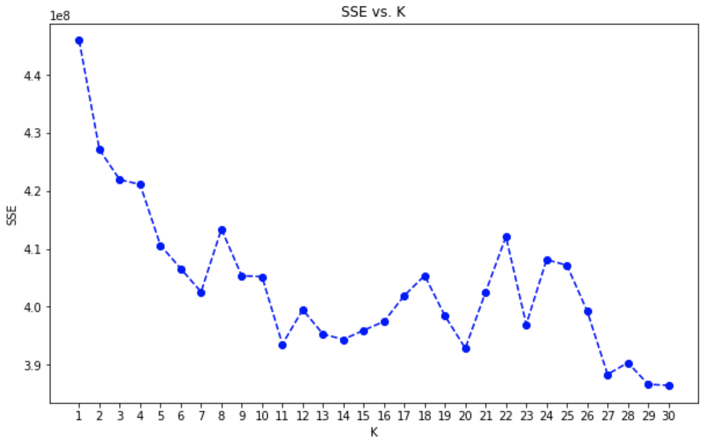

The 'elbow method' is not applicable in the plot because there is no visible leveling observed. Even though 30 clusters did not produce the lowest SSE, it was still used as the number of clusters for the full KMeans clustering operation.
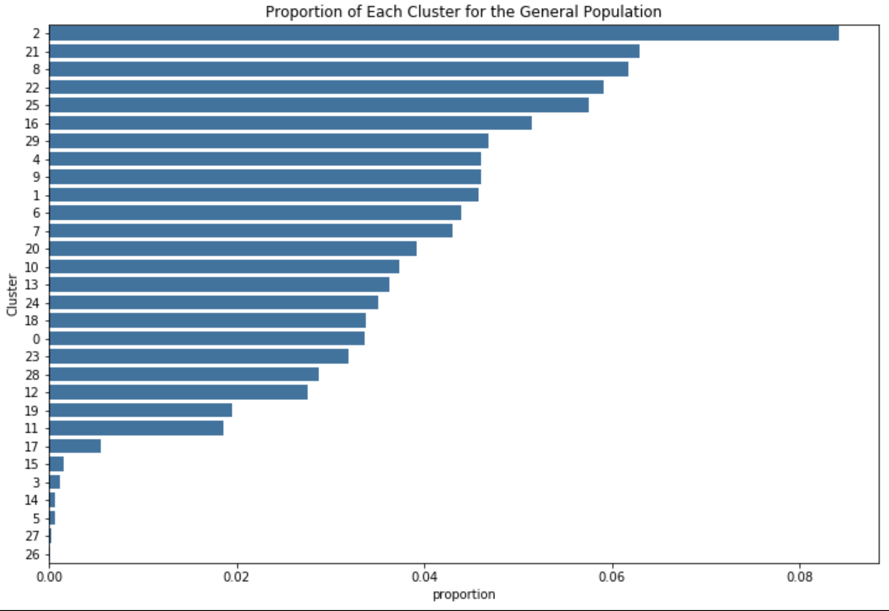

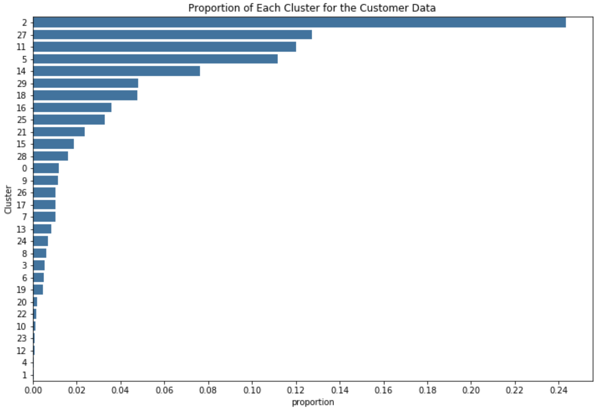
#### Compare Customers to general Population
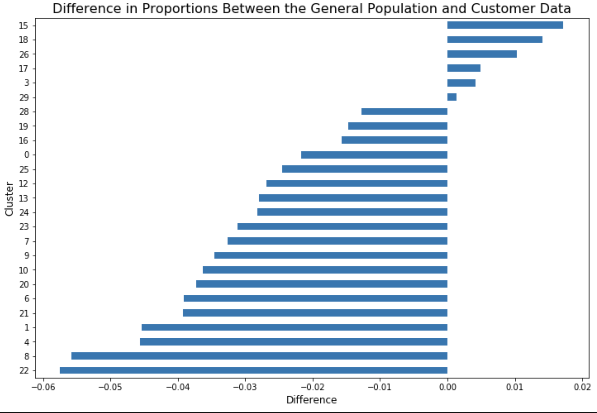

After calculating the proportion difference between 2 datasets' clusters, I can tell that cluster 2 is over-represented and cluster 22 is under-represented. For simplicity, I only compared the variables mentioned in the PCA sections.

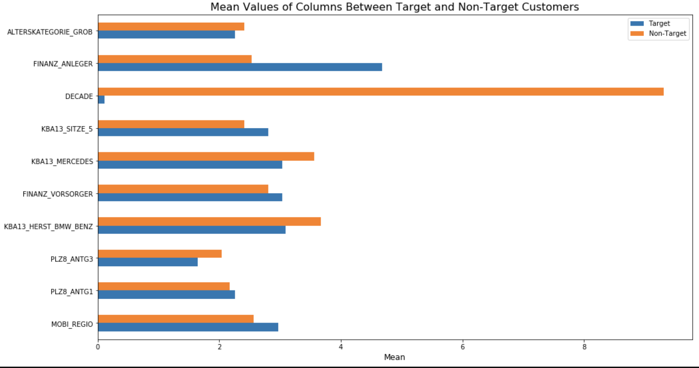

By comparing these two clusters, two out of the ten features above are clearly different. These are FINANZ_ANLEGER, DECADE. The target customers have less recent dominating movements in their youths which probably means they are older, and have less potential to invest.

-----------
## Customer Conversion Prediction
### Data Exploration
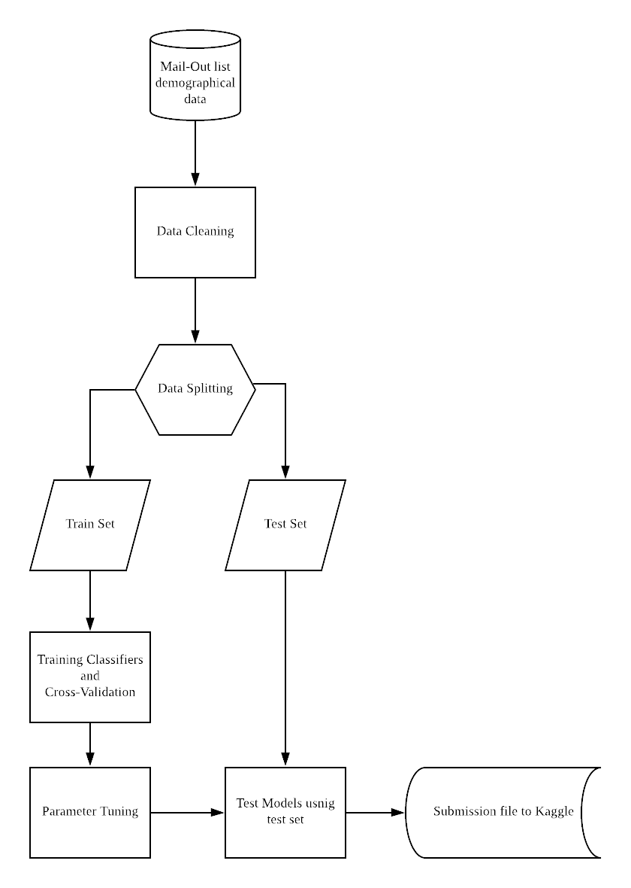

The response of our data is highly imbalanced.

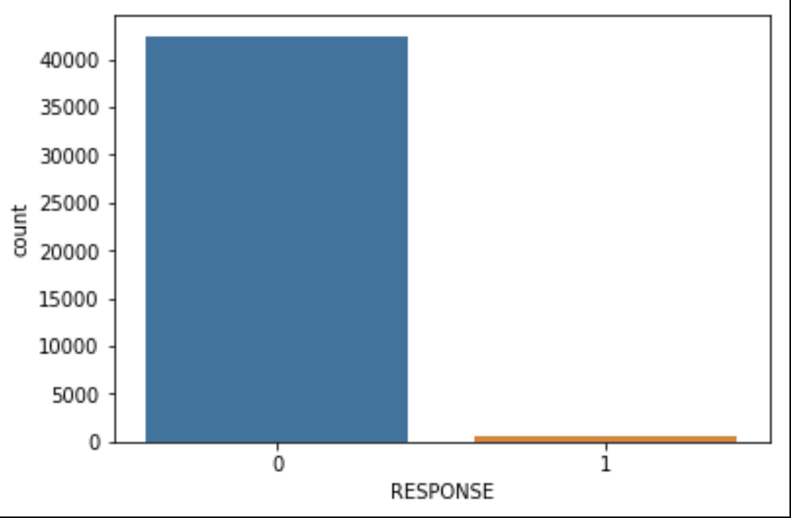

There are a number of approaches to deal with class imbalance which have been already explained by numerous blog posts from different experts. This particular article from Analytics Vidhya describes the following techniques:
* Random Over-sampling
* Random Under-sampling
* Cluster-Based Over-sampling
* Informed Over Sampling: Synthetic Minority Over-sampling Technique (SMOTE)
* Modified synthetic minority oversampling technique (MSMOTE)

The above approaches deals with handling imbalanced data by resampling original data to provide balanced classes. The same article also provides an alternative approach of modifying existing classification algorithms to make them appropriate for imbalanced data sets.
* Bagging-Based
* Boosting-Based
* Adaptive Boosting
* Gradient Tree Boosting
* Extreme Gradient Boosting
* Light GBM
* CatBoost
The AdaBoost,XGBoost and Gradient Tree Boost algorithms will be investigated to determine which is best at modeling the data.

### Model Selection and Tuning

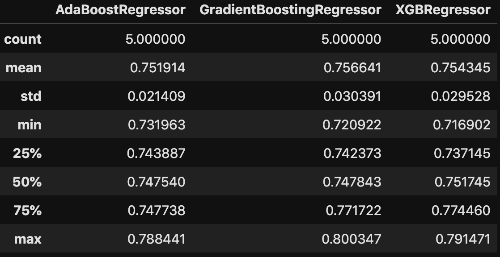

After running 3 baseline models, the Gradient Tree Boosting method actually beats other two methods by a small margin. However, the difference is not that much between XGBoost and Gradient Tree Boosting. Considering the training time and tuning time, I will still choose XGBoost. And here is the output of variable importance using the fine-tuned model. The top 10 variables are:

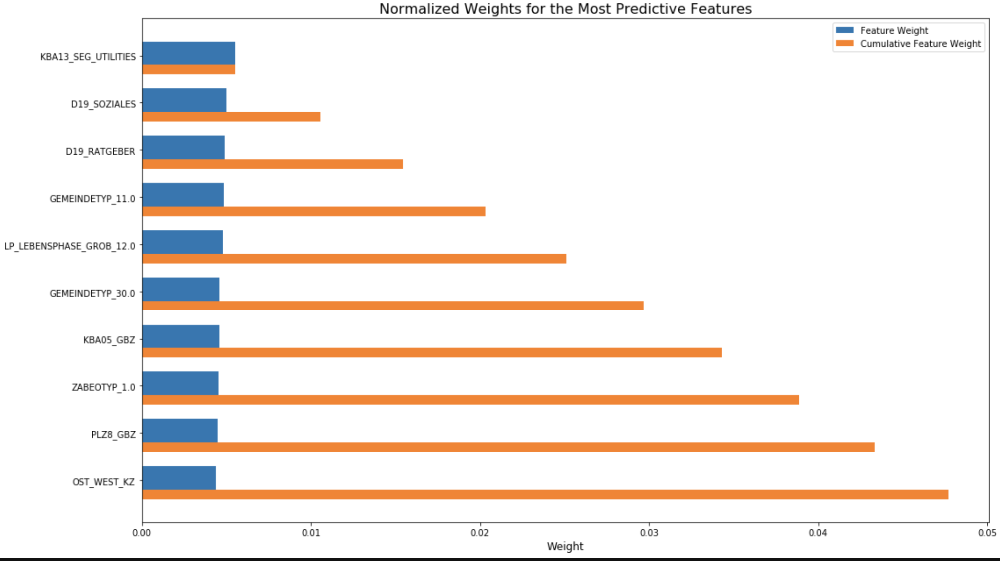

* KBA13_SEG_UTILITIES - share of MUVs/SUVs
* D19_RATGEBER_RZ - transactional activity based on the product group GUIDEBOOKS
* LP_LEBENSPHASE_GROB - lifestage rough
* KBA05_GBZ - number of buildings in the microcell
* ZABEOTYP - typification of energy consumers
* PLZ8_GBZ - number of buildings within the PLZ8
* OST_WEST_KZ - flag indicating the former GDR/FRG

------------
## Kaggle competition
Using the model generated in the above section, I submitted my prediction result to the Kaggle competition portal.

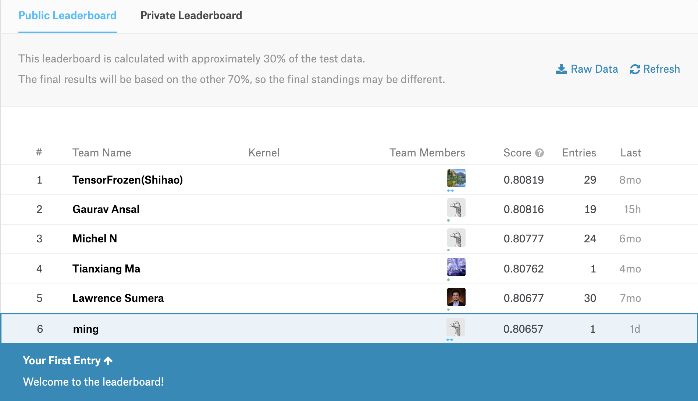

And the final score is 0.80657 out of 1 using the metric of AUC-ROC.I ranked the 6th amount the whole population. Just slightly lower than the first place with score 0.80819.

---------------
## Improvement
In order to save time and wrap up the project as fast as possible, I mainly follow the approach from other posts. If I have more time, I would also try LightGBM and CatBoost because these methods are also famous for fast training and high accuracy. Besides,
